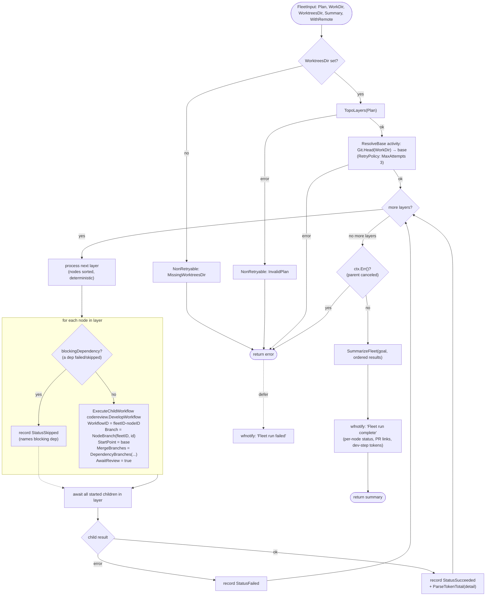
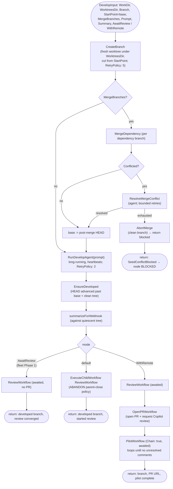

# Fleet workflows

The `fleet` package implements fan-out orchestration on top of Temporal. It
exposes two workflows:

- **`FleetPlanWorkflow`** — the *plan* step. A read-only Pi agent decomposes a
  high-level goal into a validated dependency graph (`FleetPlan`) for the user
  to review before executing. It makes no code changes.
- **`FleetWorkflow`** — the *execute* step. It orchestrates an approved
  `FleetPlan` in dependency layers, running one child
  `codereview.DevelopWorkflow` per node.

Both are driven from `workflow.go`; the pure domain logic (plan validation,
`TopoLayers`, prompt building, plan parsing, result aggregation) lives in
`domain.go`; the driven adapters (Pi agent, Git) are wired through
`activities.go` / `ports.go`.

> Dependencies gate both **ordering** and **what a node builds on**. Every node
> develops on its own run-scoped branch/worktree cut from a single pinned base,
> and a dependent's branch is **seeded by merging in its dependencies' branches**
> — so it is developed and reviewed on top of the committed, reviewed work of
> the slices it depends on.

---

## `FleetPlanWorkflow` — decompose a goal into a plan

**Notes**

- Planning is contracted read-only and *enforced*: the agent runs in a
  disposable detached worktree under a read-only tool policy, and a content
  **fingerprint tripwire** re-reads the source repo afterwards — a mismatch
  fails non-retryably (`PlanningMutatedRepo`) so a plan is never returned from a
  run that escaped the sandbox.
- The agent step is not retried (`MaximumAttempts: 1`): a re-run would produce a
  different graph.

---

## `FleetWorkflow` — orchestrate the approved plan

**Notes**

- **`WorktreesDir` is required.** An empty value would send every child down
  `DevelopWorkflow`'s in-place branch path against the same `WorkDir`, letting
  parallel children mutate one working tree. It is rejected before any work
  starts.
- **Layered execution.** `TopoLayers` groups nodes by longest dependency chain
  length. Every node in a layer runs concurrently as a child workflow; the next
  layer starts only once the current layer has fully settled, so dependents see
  their prerequisites' final status.
- **Skips propagate ordering, not code.** A node whose dependency failed or was
  skipped is marked `StatusSkipped` (running it would be pointless), while
  independent branches keep running.
- **Pinned base + dependency seeding.** `ResolveBase` captures repo HEAD once at
  the start; every child branch is cut from that same commit via `StartPoint`
  (stable even if the checkout moves), then seeded by merging in the branches of
  the node's dependencies (`DependencyBranches` → `DevelopInput.MergeBranches`),
  so a dependent is developed on top of its prerequisites' committed work.
- **Awaited review (Phase 1).** Each node runs with `AwaitReview = true`: the
  child returns only after its local review loop has converged, so a dependent
  starts once its prerequisites have been both developed **and** reviewed.
- **Cancellation.** After the layer loop, `ctx.Err()` is surfaced so a canceled
  run terminates as *canceled* rather than building a summary and completing.

---

## Child: `codereview.DevelopWorkflow` (per node)

Each fleet node reuses the existing develop pipeline rather than reimplementing
it. After creating the branch it optionally seeds it from `MergeBranches`, then
forks on mode: the fleet drives every node with **`AwaitReview`** (Phase 1);
the `default` and `WithRemote` modes are the standalone `code develop` paths.

**Notes**

- **Seeding.** When `MergeBranches` is set (a dependent node), each dependency
  branch is merged into the fresh branch before the agent runs (`MergeDependency`
  per branch); the post-seed HEAD becomes `EnsureDeveloped`'s base — so that
  check verifies the *develop agent* (not the seeding merges) advanced the
  branch.
- **Seed conflicts.** A conflicting dependency merge is resolved by the agent
  (`ResolveMergeConflict`, bounded retries). If resolution is exhausted the
  merge is aborted (`AbortMerge`, leaving the branch clean — no conflict markers)
  and the workflow returns the non-retryable `SeedConflictBlocked` type, which
  the fleet records as the node being **blocked** (recoverable) rather than
  failed; its dependents are still gated.
- **`AwaitReview` (fleet Phase 1).** The child runs the local review loop as a
  supervised, awaited child and returns once it converges, without opening a PR
  or running the pilot. This is what lets the fleet gate a dependent on its
  prerequisites being both developed and reviewed.
- The **`default`** (abandoned review) and **`WithRemote`** (review → open PR →
  Copilot pilot) modes are the standalone `code develop` behaviours; the fleet
  does not use them for Phase 1. `ParseTokenTotal` extracts the develop-step
  token usage aggregated across nodes, and `SummarizeFleet` scans a child's
  summary (`extractPRURL`) for a PR link when the remote phase surfaces one.
