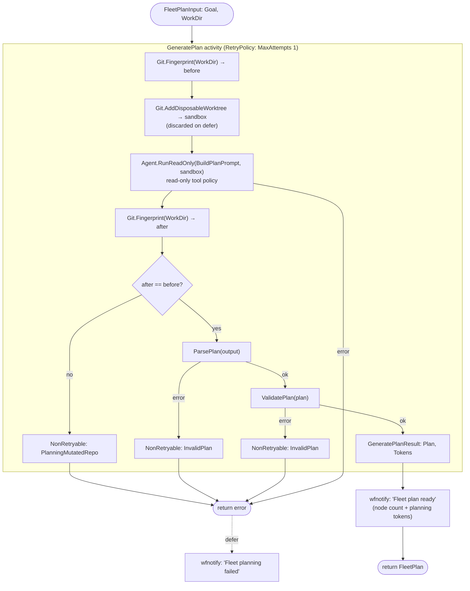
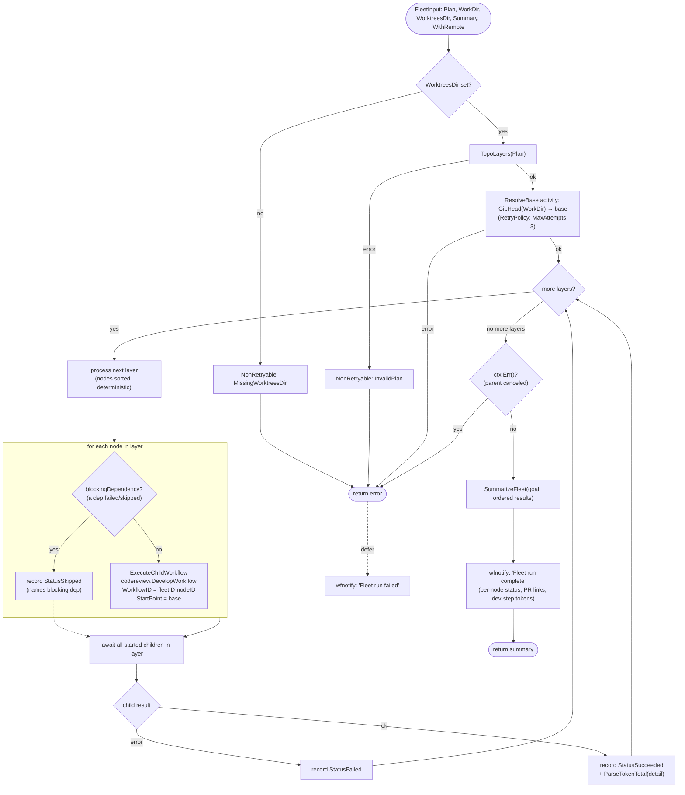
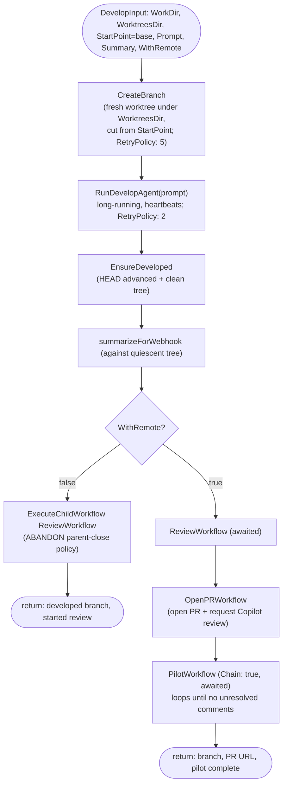

# Fleet workflows

The `fleet` package implements fan-out orchestration on top of Temporal. It
exposes two workflows:

- **`FleetPlanWorkflow`** — the *plan* step. A read-only Pi agent decomposes a
  high-level goal into a validated dependency graph (`FleetPlan`) for the user
  to review before executing. It makes no code changes.
- **`FleetWorkflow`** — the *execute* step. It orchestrates an approved
  `FleetPlan` in dependency layers, running one child
  `codereview.DevelopWorkflow` per node.

Both are driven from `workflow.go`; the pure domain logic (plan validation,
`TopoLayers`, prompt building, plan parsing, result aggregation) lives in
`domain.go`; the driven adapters (Pi agent, Git) are wired through
`activities.go` / `ports.go`.

> Dependencies gate execution **ordering**, not code layering. Every node
> develops on its own branch/worktree cut from a single pinned base, so a
> dependent node does **not** inherit its prerequisites' commits.

---

## `FleetPlanWorkflow` — decompose a goal into a plan

**Notes**

- Planning is contracted read-only and *enforced*: the agent runs in a
  disposable detached worktree under a read-only tool policy, and a content
  **fingerprint tripwire** re-reads the source repo afterwards — a mismatch
  fails non-retryably (`PlanningMutatedRepo`) so a plan is never returned from a
  run that escaped the sandbox.
- The agent step is not retried (`MaximumAttempts: 1`): a re-run would produce a
  different graph.

---

## `FleetWorkflow` — orchestrate the approved plan

**Notes**

- **`WorktreesDir` is required.** An empty value would send every child down
  `DevelopWorkflow`'s in-place branch path against the same `WorkDir`, letting
  parallel children mutate one working tree. It is rejected before any work
  starts.
- **Layered execution.** `TopoLayers` groups nodes by longest dependency chain
  length. Every node in a layer runs concurrently as a child workflow; the next
  layer starts only once the current layer has fully settled, so dependents see
  their prerequisites' final status.
- **Skips propagate ordering, not code.** A node whose dependency failed or was
  skipped is marked `StatusSkipped` (running it would be pointless), while
  independent branches keep running.
- **Pinned base.** `ResolveBase` captures repo HEAD once at the start; every
  child worktree branches from that same commit via `StartPoint`, so a later
  layer branches from the same base as the first even if the checkout moves —
  and never inherits a prerequisite's commits.
- **Cancellation.** After the layer loop, `ctx.Err()` is surfaced so a canceled
  run terminates as *canceled* rather than building a summary and completing.

---

## Child: `codereview.DevelopWorkflow` (per node)

Each fleet node reuses the existing develop pipeline rather than reimplementing
it. Behaviour forks on `WithRemote` (propagated from `FleetInput`).

**Notes**

- In the **default** mode the child returns once the develop step landed its
  commits and the review loop was *started* (abandoned child), so the fleet
  releases dependents after the develop step — not after review converges.
- With **`WithRemote`** the child supervises the full pipeline (review → open PR
  → Copilot pilot) as awaited children and returns only once the pilot loop has
  converged; the fleet then waits for that whole pipeline before a dependent
  starts.
- The PR URL is threaded into the child's summary string; `SummarizeFleet`
  scans that summary (`extractPRURL`) to surface each node's PR link, and
  `ParseTokenTotal` extracts the develop-step token usage aggregated across
  nodes.
